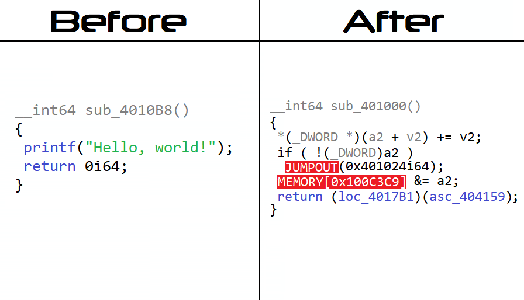

# obfus.h

**[obfus.h](https://github.com/DosX-dev/obfus.h/blob/main/include/obfus.h)** is a macro-only library for compile-time obfuscating C applications, designed specifically for the **[Tiny C (tcc)](https://bellard.org/tcc/)**. It is tailored for Windows x86 and x64 platforms and supports almost all versions of the compiler. **Very reliable armor for your C programs!**

- 🔍 **Function Call Obfuscation**: Confuse function calls to make your code less readable to unauthorized eyes.
- 🛡️ **Anti-Debugging Techniques**: Built-in mechanisms to prevent code analysis during runtime.
- 🔄 **Control Flow Code Mutation**: Turns code into spaghetti, making it difficult to parse conditions and loops.
- 🚫 **Anti-Decompilation Techniques**: Makes many popular decompilers useless visually breaking their output.
- 😈 **Fake Signatures Adding**: Can add fake signatures of various packers and protectors to confuse reverse engineers.

## Usage

Integrating **[obfus.h](https://github.com/DosX-dev/obfus.h/blob/main/include/obfus.h)** into your project is a simple process. Just include the following line in your code:
```c
#include "obfus.h"
```
This will automatically obfuscate your code during compilation, ensuring protection and confidentiality of your intellectual property.

> Available options for protection configuring:
> ```c
> // Additional options
> #define cflow_v2       1  // More powerful Control Flow obfuscation (slowly!)
> #define antidebug_v2   1  // Use better dynamic anti-debugging protection
> #define fake_signs     1  // Adds fake signatures of various protectors or packers
> 
> // Disabling default features
> #define no_cflow       1  // Don't use Control-Flow obfuscation
> #define no_antidebug   1  // Don't build in debugging protection
> ```
> or use it with compiler args:
> 
> ```
> tcc "app.c" -w  -D no_cflow  -D antidebug_v2  -D fake_signs
> ```

⚠️ When compiling an application with obfuscation, use the `-w` argument to suppress warnings. Otherwise, the console will display numerous intimidating logs that have no impact on the final result. There's no need to be alarmed by them.

🔐 Debugging protection is triggered by calls to many basic MSVCRT functions.
In critical places in the code you can use the `ANTI_DEBUG;` construct. For example:
```c
ANTI_DEBUG;
if (!licenseExpired()) {
    // ...
}
```

## Example
If you need advanced protection against skilled reversers, use `cflow_v2` and `antidebug_v2` options.
```c
// Let's obfuscate your code!

#include <stdio.h>

#define cflow_v2     1 // [+] ControlFlow v2
#define fake_signs   1 // [+] Fake signatures
#define antidebug_v2 1 // [+] AntiDebug v2
#define no_cflow     0 // [-] Disable ControlFlow
#define no_antidebug 0 // [-] Disable AntiDebug

#include "obfus.h"

void main() {
    char *out = malloc(256);

    strcpy(out, "Hello, world!");

    if (out) {
        printf(out);
    } else {
        printf("Error!");
    }
}
```

> **What the diagrammatic code will look like after obfuscation:**


> **The reverser will see something like this if he tries to use a decompiler:**


## Compiler (important)
The latest version of **Tiny C** (`0.9.27`) is recommended for use. Unfortunately, some versions of the compiler do not support the functionality needed to completely obfuscation. **Visual C**, **GCC** and **Clang** *is not supported* and is unlikely to be supported.

## Summarize
The code of a program (and its original original logic) protected using **[obfus.h](https://github.com/DosX-dev/obfus.h/blob/main/include/obfus.h)** is almost impossible to recover (deobfuscate). However, using this obfuscator does not guarantee complete protection against all types of threats. **It's important to develop and maintain internal program security systems.**

## Special thanks
Thanks to everyone who helped in the development of this project. I appreciate it! ❤️
 * 👨🏼‍💻 **[@horsicq](https://github.com/horsicq)** *(for help with the code and advices)*
 * 🦊 **[@ac3ss0r](https://github.com/ac3ss0r)** *(for cool ideas and their solutions)*

And **thanks to you** for paying attention to this project!