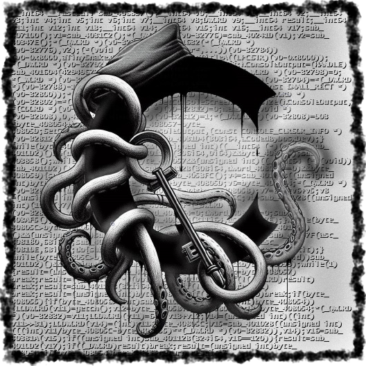
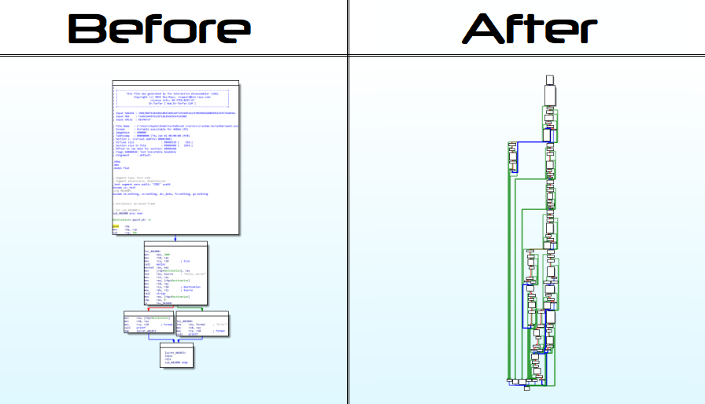

# obfus.h
**[obfus.h](https://github.com/DosX-dev/obfus.h/blob/main/include/obfus.h)** is a macro-only library for compile-time obfuscating C applications, designed specifically for the **[Tiny C (tcc)](https://bellard.org/tcc/)**. It is tailored for Windows x86 and x64 platforms and supports all versions of the compiler.

- 🔍 **Function Call Obfuscation**: Confuse function calls to make your code less readable to unauthorized eyes.
- 🛡️ **Anti-Debugging Techniques**: Built-in mechanisms to prevent code analysis during runtime.
- 🔄 **Control Flow Code Mutation**: Turns code into spaghetti, making it difficult to parse conditions and loops.

## Usage

Integrating **[obfus.h](https://github.com/DosX-dev/obfus.h/blob/main/include/obfus.h)** into your project is a simple process. Just include the following line in your code:
```c
#include "obfus.h"
```
This will automatically obfuscate your code during compilation, ensuring protection and confidentiality of your intellectual property.

> Available options for protection configuring:
> ```c
> #define no_cflow       1  // Don't use Control-Flow obfuscation
> #define no_antidebug   1  // Don't build in debugging protection
> #define hide_antidebug 1  // Use dynamic calls to hide antidebugger
> ```
> or use it with compiler args:
> 
> ```
> tcc "app.c" -w  -D no_cflow  -D no_antidebug
> ```

⚠️ When compiling an application with obfuscation, use the `-w` argument to suppress warnings. Otherwise, the console will display numerous intimidating logs that have no impact on the final result. There's no need to be alarmed by them.

## Example
```c
// Let's obfuscate your code!

#include <stdio.h>

// #define no_cflow      1
// #define no_antidebug  1
#include "obfus.h"

void main() {
    char *out = malloc(256);

    strcpy(out, "Hello, world!");

    if (out) {
        printf(out);
    } else {
        printf("Error!");
    }
}
```



## Version
The obfuscator was written with support for **Tiny C** of any version (even `0.9.24`). However, for best results, you should use the latest version of the compiler. It opens up more possibilities for confusion