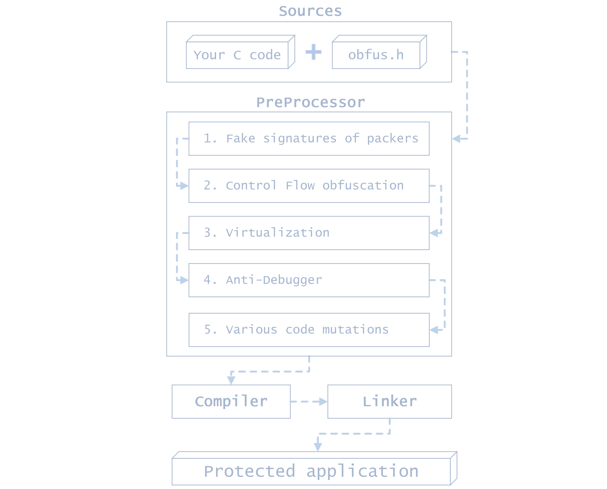

# obfus.h

**[obfus.h](https://github.com/DosX-dev/obfus.h/blob/main/include/obfus.h)** is a macro-only library for compile-time obfuscating C applications, designed specifically for the **[Tiny C (tcc)](https://bellard.org/tcc/)**. It is tailored for Windows x86 and x64 platforms and supports almost all versions of the compiler. **Very reliable armor for your C programs!**

### What features does it have?...
- 🔍 **Function Call Obfuscation**: Confuse function calls to make your code less readable to unauthorized eyes.
- 🛡️ **Anti-Debugging Techniques**: Built-in mechanisms to prevent code analysis during runtime.
- 🔄 **Control Flow Code Mutation**: Turns code into spaghetti, making it difficult to parse conditions and loops.
- 🧶 **Strings Hiding**: Hides specified strings in a file and dynamically collects them when executed.
- 🚫 **Anti-Decompilation Techniques**: Makes many popular decompilers useless visually breaking their output.
- 😈 **Fake Signatures Adding**: Can add fake signatures of various packers and protectors to confuse reverse engineers.
- 🧠 **Virtualization**: Makes math operations very difficult to understand using virtual machine commands.

## 👾 Usage

Integrating **[obfus.h](https://github.com/DosX-dev/obfus.h/blob/main/include/obfus.h)** into your project is a simple process. Just include the following line in your code:
```c
#include "obfus.h"
```
This will automatically obfuscate your code during compilation, ensuring protection and confidentiality of your intellectual property.

> Available options for protection configuring:
> ```c
> // Advanced code protection (see the "Virtualization" part of the documentation!)
> #define VIRT           1  // Allows you to use the functions of a math VM
> 
> // Additional options
> #define CFLOW_V2       1  // More powerful Control Flow obfuscation (slowly!)
> #define ANTIDEBUG_V2   1  // Use better dynamic anti-debugging protection
> #define FAKE_SIGNS     1  // Adds fake signatures of various protectors or packers
> 
> // Disabling default features
> #define NO_OBF         1  // Don't obfuscate (for debugging)
> #define NO_CFLOW       1  // Don't use Control-Flow obfuscation
> #define NO_ANTIDEBUG   1  // Don't build in debugging protection
> ```
> or use it with compiler args:
> 
> ```
> tcc "app.c" -w  -D NO_CFLOW  -D ANTIDEBUG_V2  -D FAKE_SIGNS  -D VIRT
> ```

> [!WARNING]
> When compiling an application with obfuscation, use the `-w` argument to suppress warnings. Otherwise, the console will display numerous intimidating logs that have no impact on the final result. There's no need to be alarmed by them.

🔐 Debugging protection is triggered by calls to many basic MSVCRT functions.
In critical places in the code you can use the `ANTI_DEBUG;` construct. For example:
```c
ANTI_DEBUG;
if (!licenseExpired()) {
	// ...
}
```

## 🧶 Strings hiding
The `HIDE_STRING(str)` obfuscates and visually hides strings by mutating them, significantly complicating their discovery and patching in the source code. When declared in this manner, the strings are assembled on the stack through `mov` instructions rather than being loaded all at once. This method ensures that the strings are not statically declared and are instead constructed at runtime, making them less susceptible to static analysis. However, it is important to note that this feature cannot be used for hiding static fields during their declaration, as it involves a function call.

> [!IMPORTANT]
> Some decompilers may still reveal them due to static optimizations. In disassembler output, the code will appear complex and cumbersome, which can deter straightforward analysis but may not fully prevent determined reverse engineering efforts.

An example of calling the `printf` function from the standard library with static hiding of the message and its decryption on the stack:
```c
char *hidden_message = HIDE_STRING("Hello, world!");
// ...
printf(hidden_message);
```

## 👺 Virtualization
This is a protection technique in which certain calculations are performed through an embedded virtual machine upon command. Makes analysis of mathematical operations **very difficult**! It will work with the `VIRT` option enabled (and only!). Otherwise, all virtual machine commands will be replaced by ordinary mathematical operators.

> [!WARNING]
> Virtualization in critical locations can impact optimization. Use with caution only in areas where it is really needed

| Function         | Type           | Op | Description                                                                | Example                              |
|------------------|----------------|----|----------------------------------------------------------------------------|--------------------------------------|
| **`VM_ADD`**     | *long*         |`+` | Adds two numbers                                                           | `VM_ADD(5, 3)` = **`8`**             |
| **`VM_SUB`**     | *long*         |`-` | Subtracts two numbers                                                      | `VM_SUB(5, 3)` = **`2`**             |
| **`VM_MUL`**     | *long*         |`*` | Multiplies two numbers                                                     | `VM_MUL(5, 3)` = **`15`**            |
| **`VM_DIV`**     | *long*         |`/` | Divides two numbers                                                        | `VM_DIV(6, 3)` = **`2`**             |
| **`VM_MOD`**     | *long*         |`%` | Calculates the modulus of two numbers                                      | `VM_MOD(5, 3)` = **`2`**             |
| **`VM_EQU`**     | *BOOL*         |`==`| Checks if two numbers are equal                                            | `VM_EQU(5, 5)` = **`true`**          |
| **`VM_NEQ`**     | *BOOL*         |`!=`| Checks if two numbers are not equal                                        | `VM_NEQ(5, 3)` = **`true`**          |
| **`VM_LSS`**     | *BOOL*         |`<` | Checks if the first number is less than the second number                  | `VM_LSS(3, 5)` = **`true`**          |
| **`VM_GTR`**     | *BOOL*         |`>` | Checks if the first number is greater than the second number               | `VM_GTR(5, 3)` = **`true`**          |
| **`VM_LEQ`**     | *BOOL*         |`<=`| Checks if the first number is less than or equal to the second number      | `VM_LEQ(3, 5)` = **`true`**          |
| **`VM_GEQ`**     | *BOOL*         |`>=`| Checks if the first number is greater than or equal to the second number   | `VM_GEQ(5, 3)` = **`true`**          |
| **`VM_ADD_DBL`** | *long double*  |`+` | Adds two double numbers                                                    | `VM_ADD_DBL(5.5, 3.2)` = **`≈8.7`**  |
| **`VM_SUB_DBL`** | *long double*  |`-` | Subtracts two double numbers                                               | `VM_SUB_DBL(5.5, 3.2)` = **`≈2.3`**  |
| **`VM_MUL_DBL`** | *long double*  |`*` | Multiplies two double numbers                                              | `VM_MUL_DBL(5.5, 3.2)` = **`≈17.6`** |
| **`VM_DIV_DBL`** | *long double*  |`/` | Divides two double numbers                                                 | `VM_DIV_DBL(6.0, 3.0)` = **`≈2.0`**  |
| **`VM_LSS_DBL`** | *BOOL*         |`<` | Checks if the first double number is less than the second double number    | `VM_LSS_DBL(3.5, 5.2)` = **`true`**  |
| **`VM_GTR_DBL`** | *BOOL*         |`>` | Checks if the first double number is greater than the second double number | `VM_GTR_DBL(5.5, 3.2)` = **`true`**  |
> The virtual machine does not support some basic `double` comparison operations.

You can use logical operators that use virtual machine calls to further complicate the understanding of your code:
| Operator        | Description               |
|-----------------|---------------------------|
| **`VM_IF`**     | Use instead of `if`       |
| **`VM_ELSE_IF`**| Use instead of `else if`  |
| **`VM_ELSE`**   | Use instead of `else`     |
> This is not a complete replacement for if/else, but is just a complication of standard operators.

A simple example of using virtualization:
```c
// ...
#define VIRT 1
// ...

// if ((2 + 2) == 4) { ... }
VM_IF (VM_EQU(VM_ADD(2, 2), 4)) {
	printf("2 + 2 == 4!");
}

// if (condition1) { ... }
// else if (condition2) { ... }
// else { ... }
VM_IF (condition1) {
	// if
} VM_ELSE_IF (condition2) {
	// else if
} VM_ELSE {
	// else
}
```

You can find examples of using all the functions of a virtual machine in the file [tests/virtualmachine.c](tests/virtualmachine.c)

## ❓ Example of using
If you need advanced protection against skilled reversers, use `CFLOW_V2` and `ANTIDEBUG_V2` options.
```c
// Let's obfuscate your code!

#include <stdio.h>

#define VIRT         1 // [+] Use math virtual machine

#define CFLOW_V2     1 // [+] ControlFlow v2
#define FAKE_SIGNS   1 // [+] Fake signatures
#define ANTIDEBUG_V2 1 // [+] AntiDebug v2

#define NO_OBF       0 // [-] Don't obfuscate (disable all)
#define NO_CFLOW     0 // [-] Disable ControlFlow
#define NO_ANTIDEBUG 0 // [-] Disable AntiDebug


#include "obfus.h"

void main() {
	char *out = malloc(256);

	strcpy(out, HIDE_STRING("Hello, world!\n"));

	if (out) {
		printf(out);
	} else {
		printf("Error!\n");
	}

	free(out);

	int result = VM_ADD(5, 7); // 5 + 7

	VM_IF (VM_EQU(result, 12)) { // (5 + 7) == 12
		printf("5 + 7 == 12");
	}
}
```

## 🤖 How it works?
> 

## 🛠 Compiler (important)
The latest version of **Tiny C** (`0.9.27`) is recommended for use. Unfortunately, some versions of the compiler do not support the functionality needed to completely obfuscation. **Visual C**, **GCC** and **Clang** *is not supported* and is unlikely to be supported.

## 🌐 obfus.h updater
You can use [special script](include-updater/obfh-update.cmd) for Windows to get the latest versions of `obfus.h` by downloading the package from the official repository. This is useful if you need to automate security updates without using `git`.

> For example, you can use it before building your project:
> ```diff
> + C:\...> call obfh-update
>   C:\...> tcc app.c -w
> ```
> The script will update the contents of the obfus.h file in the current directory (according to the specified configuration)

## 📖 Summarize
The code of a program (and its original original logic) protected using **[obfus.h](https://github.com/DosX-dev/obfus.h/blob/main/include/obfus.h)** is almost **impossible to recover (deobfuscate)**. However, using this obfuscator does not guarantee complete protection against all types of threats. **It's important to develop and maintain internal program security systems.**

> **What the diagrammatic code will look like after obfuscation:**
> 

> **The reverser will see something like this if he tries to use a decompiler:**
> 

> **This is what all hidden strings via `HIDE_STRING` feature look like in the disassembler (x86-64 arch):**
> ```asm
>   ; ; ; ; ; ; ; ; ; ; ; ; ; ; ; ; ; ; ; ; ; ; ; ; ; ; ; ; ; ; ; ; ;
>   ; PROTECTED STRING:                  ; ORIGINAL STRING:         ;
>   mov eax, 48h                         lea rax, aHelloWorld       ;
>   mov [rbp-0Fh], al                    mov r11, rax               ;
>   mov eax, 65h                         ; . . .                    ;
>   mov [rbp-0Eh], al                                               ;
>   mov eax, 6Ch                                                    ;
>   mov [rbp-0Dh], al                                               ;
>   mov eax, 6Ch                                                    ;
>   mov [rbp-0Ch], al                                               ;
>   mov eax, 6Fh                                                    ;
>   mov [rbp-0Bh], al                                               ;
>   mov eax, 2Ch                                                    ;
>   ; etc . . .                                                     ;
>   ; ; ; ; ; ; ; ; ; ; ; ; ; ; ; ; ; ; ; ; ; ; ; ; ; ; ; ; ; ; ; ; ;
> ```

<!-- ```c
// BEFORE OBFUSCATION       
__int64 sub_4010B8() {
	printf("Hello, world!");
	return 0i64;
}
```

```c
// AFTER OBFUSCATION
 __int64 sub_401000() {
	 *(_DWORD *)(a2 + v2) += v2;
	 if ( !(_DWORD)a2 )
	   JUMPOUT(0x100C3C9);
	 MEMORY[0x100C3C9] &= a2;
	 return (loc_4017B1)(asc_404159);
 }
``` -->

## 🌈 Special thanks
Thanks to everyone who helped in the development of this project. I appreciate it! ❤️
 * 👨🏼‍💻 **[@horsicq](https://github.com/horsicq)** *(for help with the code and advices)*
 * 🐺 **[@ac3ss0r](https://github.com/ac3ss0r)** *(for cool ideas and their solutions)*

And **thanks to you** 🤝 for paying attention to this project!
